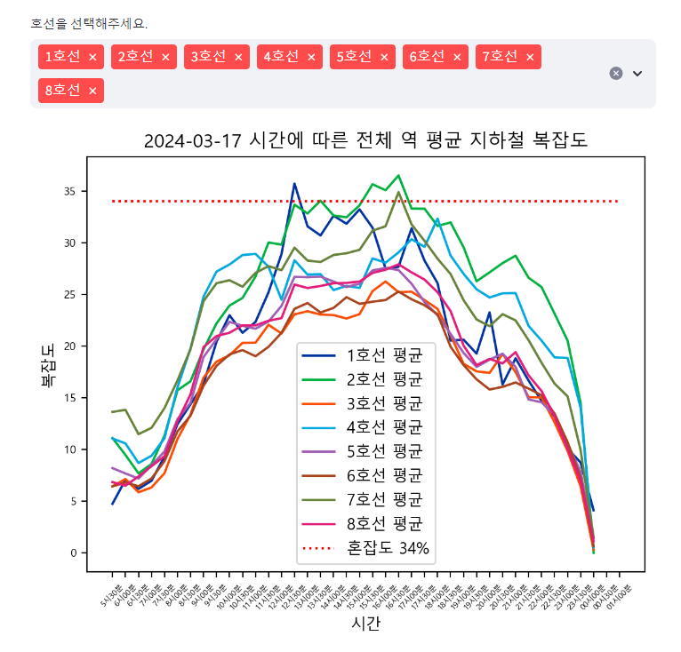
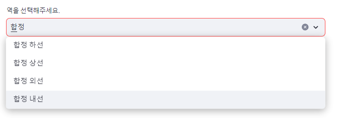
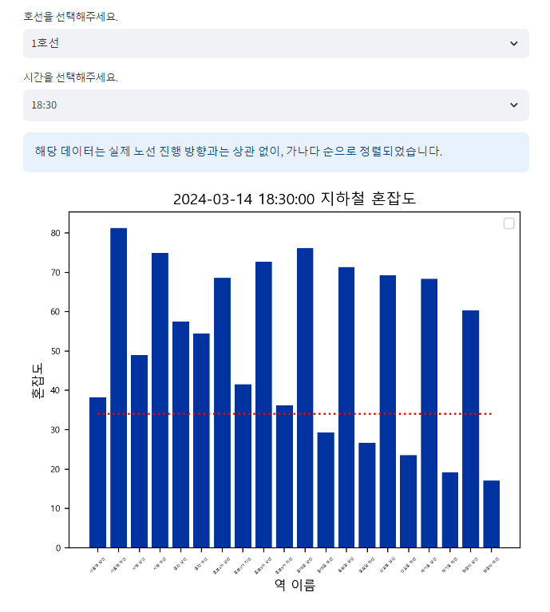
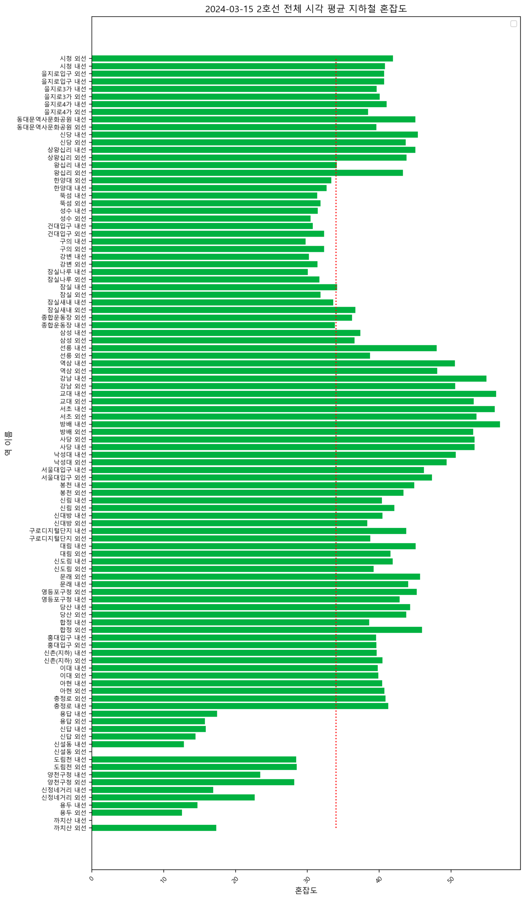

# Seoul_Metro_Project

본 프로젝트는 공공 데이터 포털에서 제공하는 "서울교통공사_지하철혼잡도정보" 정보를 기반으로 하여 시간별, 호선별 지하철의 혼잡도를 나타내고 이를 다른 호선과 비교하거나 함께 볼 수 있도록, 그리고 챗봇을 이용해 어느 지하철을 탈 것인지 추천을 받는 것을 목표로 하고 있습니다.

### 목표하는 기능 구현
1. "서울교통공사_지하철혼잡도정보"를 CSV 파일로 받아 특정 역의 시간별 호선의 혼잡도 데이터, 모든 역의 전체적인 시간별 호선의 혼잡도 데이터, 특정 역의 호선별 혼잡도 데이터, 모든 역의 전체적힌 호선별 혼잡도 데이터, 특정 호선의 동일 시간대 역별 혼잡도 데이터, 특정 호선의 전체적인 시간 대 역별 혼잡도 데이터를 비교하기

2. 특정 역의 시간별 비교에서는 Select Box를 통해 비교할 역을 고르고, Multi Select 기능을 넣어 비교할 호선을 다수 선택할 수 있도록 하기 : 꺾은선 그래프를 통해 시간별 변화 추이 확인하기
3. 전체 역의 시간별 비교에서는 데이터의 평균 및 전반적인 통계값을 사용하며, Multi Select 기능만을 넣어 호선 별 비교할 수 있도록 하기 : 꺾은선 그래프를 통해 시간별 변화 추이 확인하기
4. 2와 3에서는 오늘의 날짜가 반영되며, 추후 Date input 기능을 통해 평일 / 토요일 / 일요일에 따른 데이터 변화 추이 보여주기

5. 특정 역의 호선별 비교에서는 Select Box를 통해 비교할 역을 고르고, 추가로 시간을 고를 Select Box를 추가하여 해당 시간에 해당 역을 지나는 모든 호선들의 혼잡도를 비교하기 : 막대 그래프를 통해 혼잡도 차이 확인하기
6. 전체 역의 호선별 비교에서는 데이터의 평균 및 전반적인 통계값을 사용하며, Multi Select를 통해 비교할 호선을 고르고 추가로 시간을 고를 Select Box를 추가하여, 해당 시간에 Multi Select로 선택한 호선의 전반적인 혼잡도를 비교하기 : Violin plot이나 barplot을 확인하여 전반적인 통계값과 혼잡도 차이가 잘 보이게 하기
7. 5와 6에서는 오늘의 날짜가 반영되며, 추후 Date input 기능을 통해 평일 / 토요일 / 일요일에 따른 데이터 변화 추이 보여주기

8. 특정 호선의 동일 시간 대 역별 혼잡도 비교에서는 Select Box를 통해 호선을 선택하고, 추가로 시간을 고를 Select Box를 추가하여 해당 시간에 고른 호선의 역에 따른 혼잡도를 비교하기 : 꺾은선 그래프 혹은 다른 그래프를 통해 역 별 혼잡도 차이 확인하기
9. 특정 호선의 전체 시간 대 역별 혼잡도 비교에서는 데이터의 평균 및 전반적인 통계값을 사용하며, Select Box를 통해 호선을 선택하면 하루의 전반적인 통계적인 역별 혼잡도를 보여줘서 비교하기
10. 8와 9에서는 오늘의 날짜가 반영되며, 추후 Date input 기능을 통해 평일 / 토요일 / 일요일에 따른 데이터 변화 추이 보여주기

11. CSV가 아닌 오픈 API 호출을 통해, CSV 파일이 없더라도 사이트가 동작하도록 하기
12. 추후 위의 기능 구현이 완성되면, 챗봇 기능을 추가하여 현재 어떤 역과 호선이 한가하고 어떤 역과 호선이 가장 붐비는지, 어떤 지하철을 탈 것인데 어느 역이 가장 붐비는지 등의 정보를 물어보고 답할 수 있도록 하기

## Ver 1.0.0 (2024.03.14 AM 10:16)
main.py 구현 완료

기본적인 뼈대 구현을 완료했으며, 시간별 데이터 분석에 착수할 예정

## Ver 1.0.1 (2024.03.14 PM 12:13)
pages.py의 period() 함수 1차 구현 완료 : 날짜 선택 기능 만들면 끝남.

중간에 아래와 같이 Streamlit의 line_chart가 자동정렬되는 기능 때문에 시간이 문자열 상의 오름차순으로 정렬되어서 시간 배열이 아닌 문자열 배열이 되는 문제가 있었음.

해당 부분은 아래와 같이 앞에 날짜를 붙여주고, 5시 30분과 같은 부분들은 앞에 0을 붙여 05시 30분으로 변경해 정렬에 우선순위를 가질 수 있게 함으로써 해결함.

period()에서 날짜 선택 기능 구현 후 period_all() 메서드를 제작할 예정.

## Ver 1.0.2 (2024.03.14 PM 14:05)
pages.py의 period() 함수 2차 구현 완료.

Streamlit에서 제공하는 line_chart의 한계를 느끼고 matplotlib를 사용했으며, Streamlit에서 제공하는 pyplot으로 그래프를 추가했다.

승차인과 좌석 수가 일치하는 34% 기준선을 추가해 혼잡도를 보다 직관적으로 표현했으며, legend label을 추가했고, 지하철의 실제 색을 따라 그래프의 선에 색을 입혔다.

날짜를 선택하는 기능을 추가해 날짜 별로 혼잡도를 확인할 수 있다. 평일 / 토요일 / 일요일의 값이 전부 다르다.

이후 period_all()을 구현하고, 금일 내에 호선별 기능까지 구현하는 것이 목표다.

## Ver 1.1.0 (2024.03.14 PM 15:24)
pages.py의 period_all() 함수 구현 완료.

본래는 박스 그래프 형식으로 시간 별 중간값과 최대 최소, 그리고 편차를 보여주려고 했지만 잘 되지 않아서 막대 그래프로 노선을 변경했다.

점산도도 생각해봤는데 x축에 시간, y축에 혼잡도를 나타내면 역을 표시할 축이 없어서 불가능 할 것 같아 평균으로 합의할 수밖에 없었다.

해당 기능을 구현하며 재미있는 점을 발견했는데 소개해보고자 한다. 전철의 호선 전체를 선택했을 때 아래의 첫 번째 그림은 평일, 그리고 두 번째 그림은 토요일, 세 번째 그림이다.

### ▼ 전체 지하철의 평일 시간별 평균 혼잡도

### ▼ 전체 지하철의 토요일 시간별 평균 혼잡도

### ▼ 전체 지하철의 일요일 시간별 평균 혼잡도

평일은 모든 지하철이 거의 비슷하게 출퇴근 시간에 혼잡도가 평균적으로 상승하는 걸 볼 수 있었지만, 토요일에는 2호선의 혼잡도가 가장 높았다. 그러나 토요일의 2호선 혼잡도가 아무리 높아도 평일의 출퇴근 시간의 혼잡도 최대값보다는 낮다는 걸 확인할 수 있었다. 일요일의 경우에는 대부분의 지하철이 혼잡도 34% 아래의 혼잡도를 보였고, 1호선과 2호선, 7호선만이 34%보다 높을 때가 있었다.

다만 이는 전체 역의 평균값이라는 점을 고려해야한다. 특정 역에는 주말에도 여전히 사람이 몰리고 한가한 역은 사람이 몰리지 않아 일어나는 현상일 수도 있기 때문에, 보다 유의미한 분석을 위해서는 평일에 가장 혼잡도가 높은도가 높은 역과 낮은 역, 주말에 가장 혼잡도가 높은 역과 낮은 역의 파악이 필요해보인다.

## Ver 1.2.0 (2024.03.14 PM 16:47)

pages.py의 line()과 line_all() 함수 구현을 완료했다. 원래는 6번과 8번이 다른 동작을 할 예정이었으나, 지하철은 노선이 다르기 때문에 동일 시간대 다른 호선의 역 별 비교가 어렵다고 판단하여 해당 기능을 line_all() 함수로 합치게 되었다.

line() 함수의 경우 실제로 환승이 많은 역이라도 해도 해당 데이터는 1~8호선까지만 되어 있다는 점, 그리고 아래 이미지와 같이 한 역이라도 상행과 하행, 외선과 내선으로 나누어져 보다 더 세밀하게 쪼개지는 바람에 상상했던 그림과는 다른 기능이 구현되긴 했다.

실제로 역과 시간대를 선택하면 아래 이미지처럼 작동한다. 붉은 선은 앞서 적용한 것과 같이 혼잡도 34%를 표시한 선인데, 이를 나타내는 라벨을 달아줬음에도 legend 표기가 잘 되지 않은 것 같다.

위 이미지는 line_total() 함수를 완성하여 페이지에서 확인했을 때다.
날짜를 선택하고 1호선의 시간대를 확인하면, 1호선의 각 역 별 혼잡도를 확인하고 비교할 수 있다. 이때 정렬은 역의 진행과 상관 없이 가나다순으로 이루어졌는데, 서울 지하철은 일직선이 아니라 1호선처럼 갈라지거나, 2호선처럼 순환하거나 하기 때문에 해당 부분은 구현이 어렵다고 판단했다. 데이터에 있는 역 번호순으로 정렬도 가능할 것 같았지만, 일단은 인접한 역 끼리의 관계보다는 특정 역과 호선의 혼잡도 비교 자체에 초점을 맞추기로 했다.

오늘은 이후 버그나 오류가 발생하는지 테스트를 진행하고, 내일 남은 기능 구현 및 챗봇 개발에 착수해볼 예정이다.

### 내일 계획
1. station_all() 함수 구현 완료
2. 혼잡도 그래프의 y축을 고정할지 말 것인지 고민
3. 배포가 가능하도록 .csv가 아니라 오픈API를 받아와서 파일과 연결하기(여기까지 오전에 끝내는 것이 목표!)
4. 챗봇과 연결하여 어떤 context를 주고 어떤 모델을 사용할 것인지, Open AI와 Langchain중 어떤 것이 적합한지 고민해보기.
5. 시간이 넉넉하다면 특정 시간에 역 별 혼잡도를 Folium을 이용하여 지도에 표시해보기.
6. 코드 튜닝(동일한 기능 하는 구간 함수로 분리) 고민하기
7. 시간 관련해서 time 대신 select로 넣을지 고민하기
8. HOME 페이지에 현재 시각 가장 바쁜/한가한 역/호선과 각 호선별 한가한/바쁜 역 보여주기

## Ver 1.3.0 (2024. 03. 15 PM 14:18)
station_all() 함수 구현 완료.

y축의 범위 고정에 대해 고민했으나, 혼잡도가 190까지 치솟는 경우도 있었기에 유동적으로 움직이는 지금 그대로 두기로 결정. 대신 bar대신 barh를 사용하여 역 이름 확인이 어렵지 않도록 했다. figsize의 크기 역시 조절하여 가장 복잡하던 2호선도 모든 역을 확인할 수 있도록 했다. 아래 이미지는 수정한 역별 이미지다.

데이터를 불러오는 방식을 기존의 .csv 파일에서 API 호출로 변경함. 이 과정에서 인증키가 필요했기에 .env 파일을 생성해서 키를 보호하기로 했다.
-> 이 과정에서 데이터 순서의 변경, 데이터 타입의 변경이 있었기에 해결했다.

시간 선택과 관련하여 기존의 time_input 위젯이 아닌 selectbox 위젯으로 바꾸어 가시성을 확보했다.

HOME 화면에 현재 가장 한가한 역과 혼잡한 역을 보여주고, 각 역별 현재시각 최대/최소 혼잡도 표기를 추가했다.

## Ver 1.3.1 (2024. 03. 15 PM 16:50)
챗봇의 기능을 구현하려고 시도해보았으나 결국 실패했다.

Langchain이나 OpenAI를 이용해 맨 처음에는 DataFrame의 정보를 줘보았지만 그 상태로는 읽지 못한다는 걸 알게 되었고,

이를 해결하기 위해 DataFrame에 있는 모든 정보를 함수를 만들어 자연어의 형태로 전처리했으나 이 경우 텍스트의 용량이 OpenAI가 처리할 수 있는 이상이 되어 원하는 기능의 챗봇은 구현이 불가능한 것으로 보인다.

남은 시간에는 Folium 사용 시도 및 코드 튜닝을 진행해보려 한다.