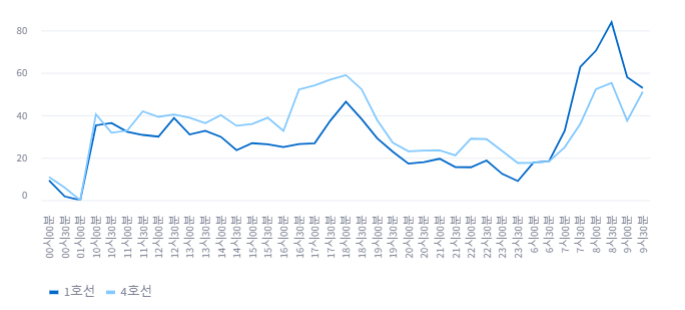
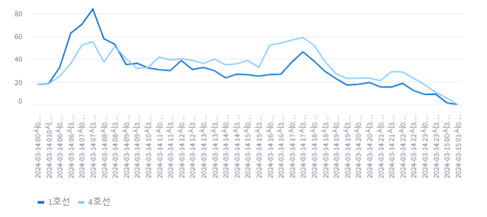
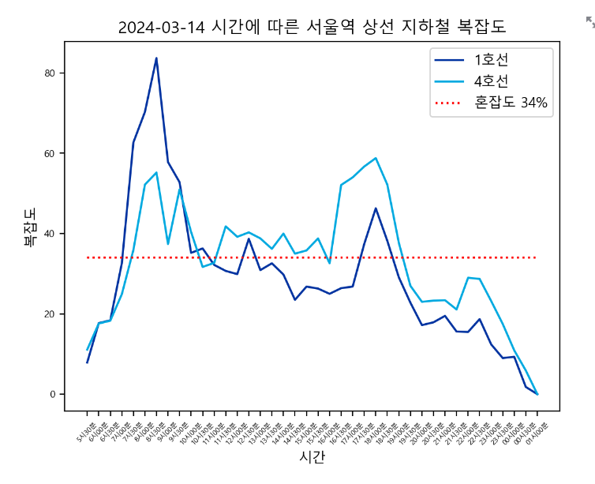
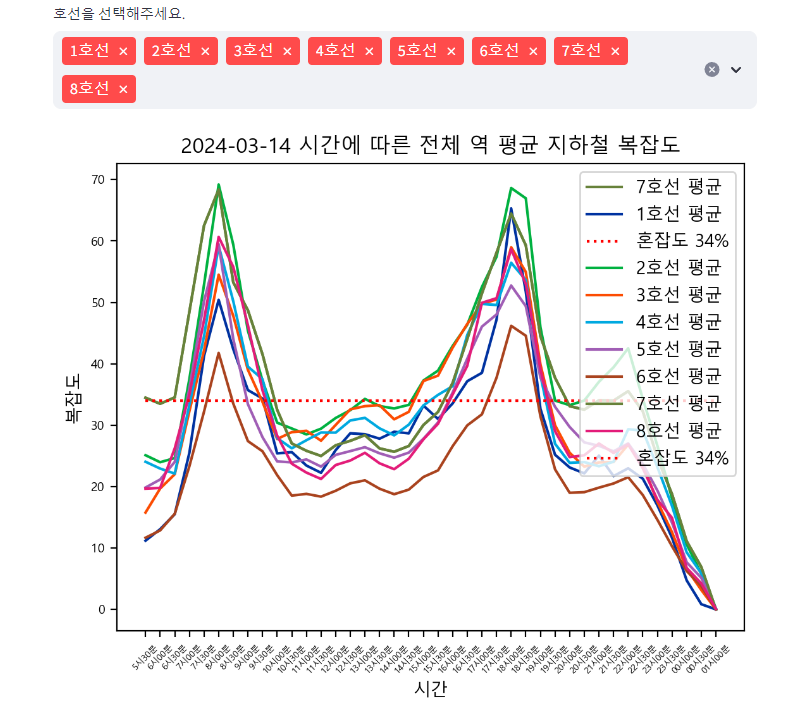
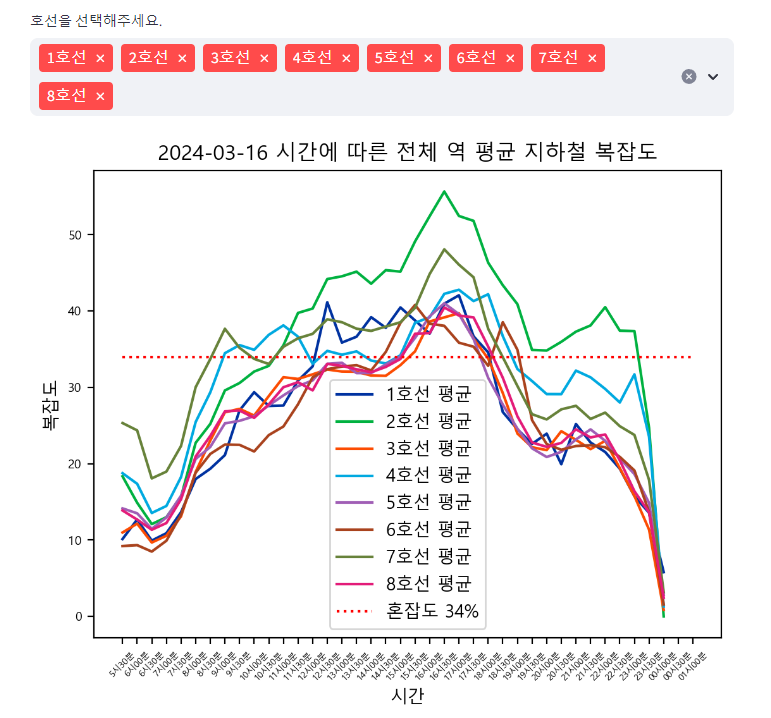

# Seoul_Metro_Project

본 프로젝트는 공공 데이터 포털에서 제공하는 "서울교통공사_지하철혼잡도정보" 정보를 기반으로 하여 시간별, 호선별 지하철의 복잡도를 나타내고 이를 다른 호선과 비교하거나 함께 볼 수 있도록, 그리고 챗봇을 이용해 어느 지하철을 탈 것인지 추천을 받는 것을 목표로 하고 있습니다.

### 목표하는 기능 구현
1. "서울교통공사_지하철혼잡도정보"를 CSV 파일로 받아 특정 역의 시간별 호선의 복잡도 데이터, 모든 역의 전체적인 시간별 호선의 복잡도 데이터, 특정 역의 호선별 복잡도 데이터, 모든 역의 전체적힌 호선별 복잡도 데이터, 특정 호선의 동일 시간대 역별 복잡도 데이터, 특정 호선의 전체적인 시간 대 역별 복잡도 데이터를 비교하기

2. 특정 역의 시간별 비교에서는 Select Box를 통해 비교할 역을 고르고, Multi Select 기능을 넣어 비교할 호선을 다수 선택할 수 있도록 하기 : 꺾은선 그래프를 통해 시간별 변화 추이 확인하기
3. 전체 역의 시간별 비교에서는 데이터의 평균 및 전반적인 통계값을 사용하며, Multi Select 기능만을 넣어 호선 별 비교할 수 있도록 하기 : 꺾은선 그래프를 통해 시간별 변화 추이 확인하기
4. 2와 3에서는 오늘의 날짜가 반영되며, 추후 Date input 기능을 통해 평일 / 토요일 / 일요일에 따른 데이터 변화 추이 보여주기

5. 특정 역의 호선별 비교에서는 Select Box를 통해 비교할 역을 고르고, 추가로 시간을 고를 Select Box를 추가하여 해당 시간에 해당 역을 지나는 모든 호선들의 복잡도를 비교하기 : 막대 그래프를 통해 복잡도 차이 확인하기
6. 전체 역의 호선별 비교에서는 데이터의 평균 및 전반적인 통계값을 사용하며, Multi Select를 통해 비교할 호선을 고르고 추가로 시간을 고를 Select Box를 추가하여, 해당 시간에 Multi Select로 선택한 호선의 전반적인 복잡도를 비교하기 : Violin plot이나 barplot을 확인하여 전반적인 통계값과 복잡도 차이가 잘 보이게 하기
7. 5와 6에서는 오늘의 날짜가 반영되며, 추후 Date input 기능을 통해 평일 / 토요일 / 일요일에 따른 데이터 변화 추이 보여주기

8. 특정 호선의 동일 시간 대 역별 복잡도 비교에서는 Select Box를 통해 호선을 선택하고, 추가로 시간을 고를 Select Box를 추가하여 해당 시간에 고른 호선의 역에 따른 복잡도를 비교하기 : 꺾은선 그래프 혹은 다른 그래프를 통해 역 별 복잡도 차이 확인하기
9. 특정 호선의 전체 시간 대 역별 복잡도 비교에서는 데이터의 평균 및 전반적인 통계값을 사용하며, Select Box를 통해 호선을 선택하면 하루의 전반적인 통계적인 역별 복잡도를 보여줘서 비교하기
10. 8와 9에서는 오늘의 날짜가 반영되며, 추후 Date input 기능을 통해 평일 / 토요일 / 일요일에 따른 데이터 변화 추이 보여주기

11. CSV가 아닌 오픈 API 호출을 통해, CSV 파일이 없더라도 사이트가 동작하도록 하기
12. 추후 위의 기능 구현이 완성되면, 챗봇 기능을 추가하여 현재 어떤 역과 호선이 한가하고 어떤 역과 호선이 가장 붐비는지, 어떤 지하철을 탈 것인데 어느 역이 가장 붐비는지 등의 정보를 물어보고 답할 수 있도록 하기

## Ver 1.0.0 (2024.03.14 AM 10:16)
main.py 구현 완료

기본적인 뼈대 구현을 완료했으며, 시간별 데이터 분석에 착수할 예정

## Ver 1.0.1 (2024.03.14 PM 12:13)
pages.py의 period() 함수 1차 구현 완료 : 날짜 선택 기능 만들면 끝남.

중간에 아래와 같이 Streamlit의 line_chart가 자동정렬되는 기능 때문에 시간이 문자열 상의 오름차순으로 정렬되어서 시간 배열이 아닌 문자열 배열이 되는 문제가 있었음.

해당 부분은 아래와 같이 앞에 날짜를 붙여주고, 5시 30분과 같은 부분들은 앞에 0을 붙여 05시 30분으로 변경해 정렬에 우선순위를 가질 수 있게 함으로써 해결함.

period()에서 날짜 선택 기능 구현 후 period_all() 메서드를 제작할 예정.

## Ver 1.0.2 (2024.03.14 PM 14:05)
pages.py의 period() 함수 2차 구현 완료.

Streamlit에서 제공하는 line_chart의 한계를 느끼고 matplotlib를 사용했으며, Streamlit에서 제공하는 pyplot으로 그래프를 추가했다.

승차인과 좌석 수가 일치하는 34% 기준선을 추가해 혼잡도를 보다 직관적으로 표현했으며, legend label을 추가했고, 지하철의 실제 색을 따라 그래프의 선에 색을 입혔다.

날짜를 선택하는 기능을 추가해 날짜 별로 혼잡도를 확인할 수 있다. 평일 / 토요일 / 일요일의 값이 전부 다르다.

이후 period_all()을 구현하고, 금일 내에 호선별 기능까지 구현하는 것이 목표다.

## Ver 1.1.0 (2024.03.14 PM 15:24)
pages.py의 period_all() 함수 구현 완료.

본래는 박스 그래프 형식으로 시간 별 중간값과 최대 최소, 그리고 편차를 보여주려고 했지만 잘 되지 않아서 막대 그래프로 노선을 변경했다.

점산도도 생각해봤는데 x축에 시간, y축에 복잡도를 나타내면 역을 표시할 축이 없어서 불가능 할 것 같아 평균으로 합의할 수밖에 없었다.

해당 기능을 구현하며 재미있는 점을 발견했는데 소개해보고자 한다. 전철의 호선 전체를 선택했을 때 아래의 첫 번째 그림은 평일, 그리고 두 번째 그림은 토요일, 세 번째 그림이다.

### ▼ 전체 지하철의 평일 시간별 평균 복잡도

### ▼ 전체 지하철의 토요일 시간별 평균 복잡도

### ▼ 전체 지하철의 일요일 시간별 평균 복잡도

평일은 모든 지하철이 거의 비슷하게 출퇴근 시간에 복잡도가 평균적으로 상승하는 걸 볼 수 있었지만, 토요일에는 2호선의 복잡도가 가장 높았다. 그러나 토요일의 2호선 복잡도가 아무리 높아도 평일의 출퇴근 시간의 복잡도 최대값보다는 낮다는 걸 확인할 수 있었다. 일요일의 경우에는 대부분의 지하철이 혼잡도 34% 아래의 복잡도를 보였고, 1호선과 2호선, 7호선만이 34%보다 높을 때가 있었다.

다만 이는 전체 역의 평균값이라는 점을 고려해야한다. 특정 역에는 주말에도 여전히 사람이 몰리고 한가한 역은 사람이 몰리지 않아 일어나는 현상일 수도 있기 때문에, 보다 유의미한 분석을 위해서는 평일에 가장 혼잡도가 높은도가 높은 역과 낮은 역, 주말에 가장 혼잡도가 높은 역과 낮은 역의 파악이 필요해보인다.